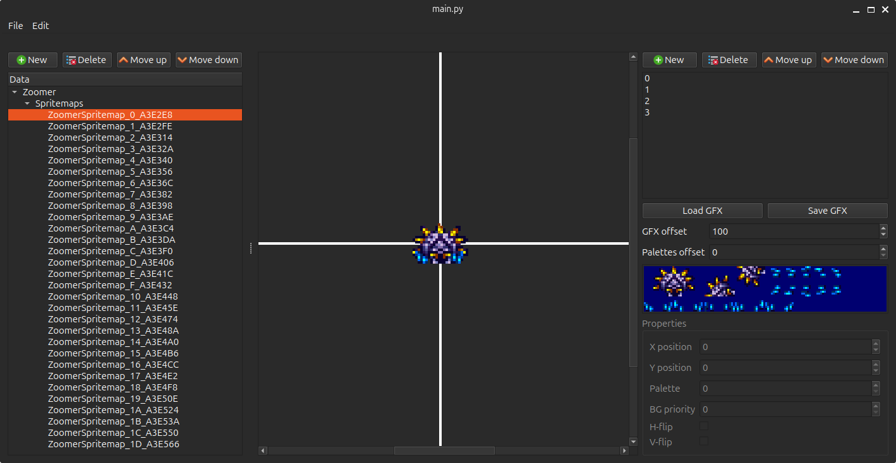

# Spritemap Editor
A general-purpose spritemap editor for Super Metroid.

It can be used, with custom ASM, to create new enemies, projectiles, and more.

Projects can be saved and loaded as .json, containing the graphics, palettes and spritemaps.

The image's format must be indexed-color PNG to be importable. When importing the image, the graphics are automatically converted to 4bpp.

# How to use
Create a venv:

`python -m venv env`

Activate venv (Linux and macOS):

`source env/bin/activate`

Activate venv (Windows):

`env\Scripts\activate.bat`

Install dependencies:

`pip install -r requirements.txt`

Run:

`python main.py` or `python main.py project.json`

# Screenshots

## Useful tools & resources
I recommend [LibreSprite](https://github.com/LibreSprite/LibreSprite) to create new graphics.

ASM files can be compiled using [Asar](https://github.com/RPGHacker/asar)

[SMART](https://edit-sm.art/subversion), a Super Metroid editor (sadly Windows only)

[ImHex](https://github.com/WerWolv/ImHex), a hex editor

[SuperFamiconv](https://github.com/Optiroc/SuperFamiconv), a command-line tool to convert PNG files to SNES graphics and tilemaps

[Tilemap Studio](https://github.com/Rangi42/tilemap-studio), a tilemap editor

[SNESdev Wiki](https://snes.nesdev.org/wiki/SNESdev_Wiki)

[SnesLab](https://sneslab.net/wiki/Main_Page)

[Metroid Construction](https://metroidconstruction.com)

For more info, and vanilla spritemaps, see https://patrickjohnston.org/bank/index.html.
